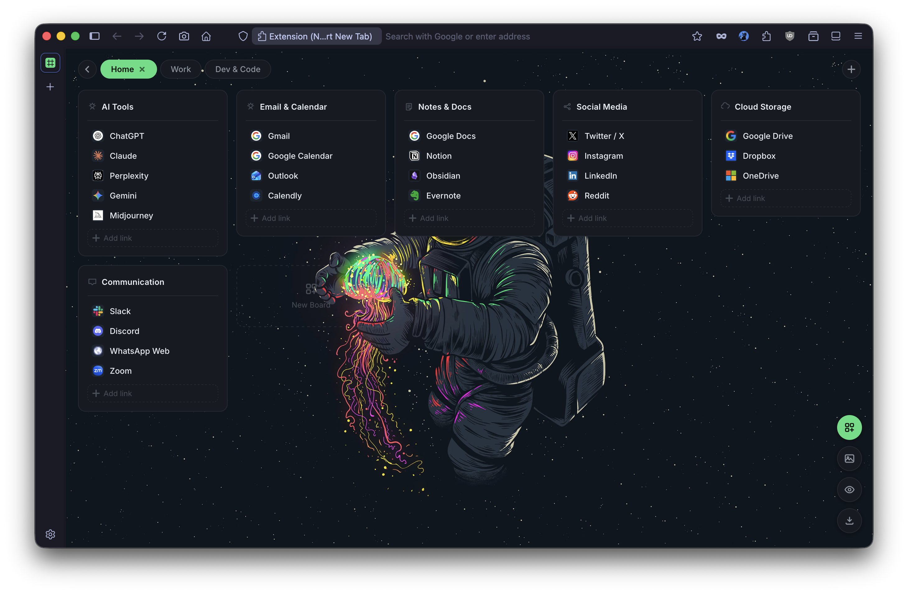
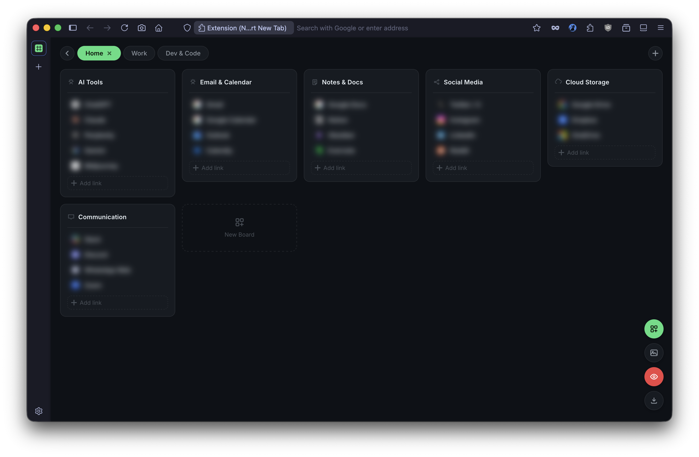
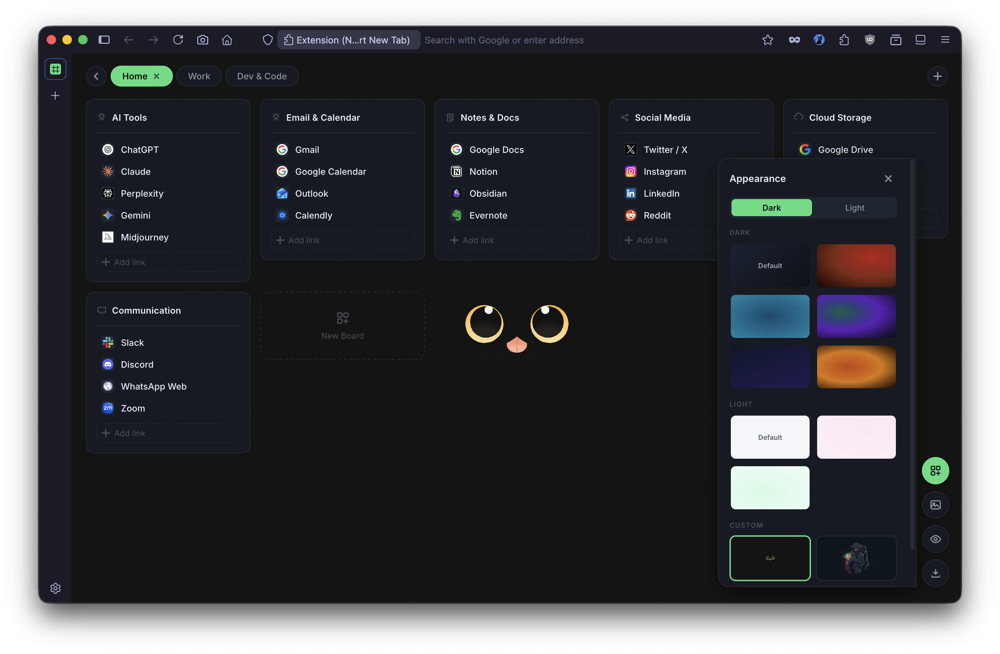
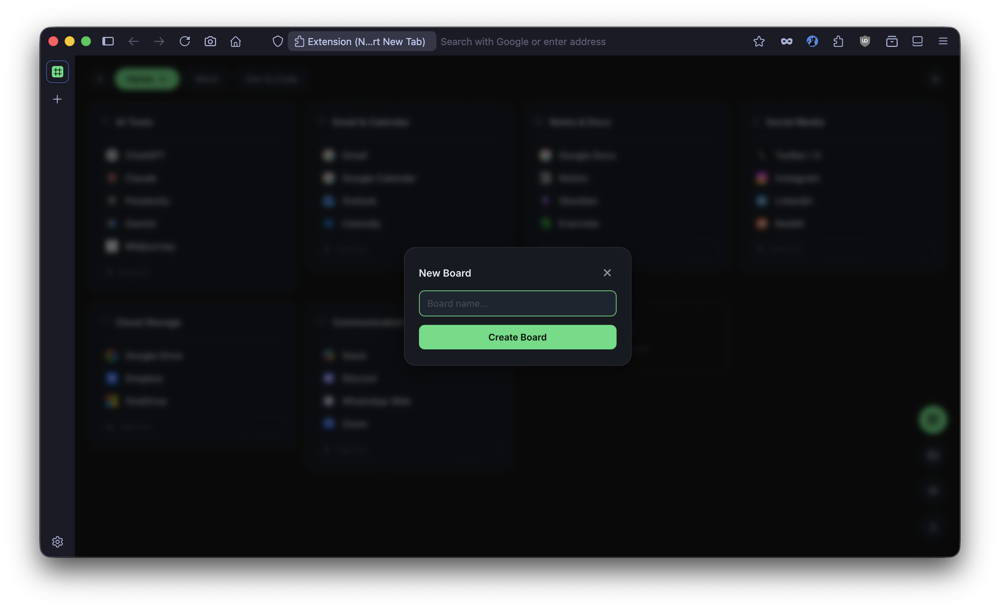

<div align="center">


# NeoTab — Smart New Tab

**A beautiful new tab page for Firefox.**
Organize your bookmarks into boards, customize your wallpaper, and keep your browsing private.

[](https://addons.mozilla.org/en-US/firefox/addon/neotab-smart-new-tab/)
[](#)
[](LICENSE)

</div>

---

## Screenshots

<div align="center">
<table>
  <tr>
    <td></td>
    <td></td>
  </tr>
  <tr>
    <td></td>
    <td></td>
  </tr>
</table>
</div>

---

## Features

- **Pages & Boards** — group links into boards, organize boards across multiple pages
- **Wallpapers** — 9 built-in themes (dark & light) + upload your own image
- **Privacy Mode** — blur all URLs with one click, perfect for screen sharing
- **Favicons** — auto-loaded for every link
- **Export** — back up your entire setup as JSON anytime
- **No accounts. No tracking.** Everything is stored locally in your browser

---

## Install

**From the Firefox Add-ons store:**

[](https://addons.mozilla.org/en-US/firefox/addon/neotab-smart-new-tab/)

**Manually:**

1. Download the latest `.zip` from [Releases](../../releases)
2. Go to `about:addons` in Firefox
3. Click the ⚙️ gear icon → **Install Add-on From File**
4. Select the downloaded `.zip`

---

## Development

```bash
# Clone the repo
git clone https://github.com/utkarshkrsingh/neotab-smart-new-tab.git
cd neotab-smart-new-tab

# Load in Firefox
# Go to about:debugging → This Firefox → Load Temporary Add-on
# Select manifest.json
```

No build step. No dependencies. Pure HTML, CSS, and JS.

---

## Project Structure

```
neotab/
├── manifest.json       # Extension manifest (MV2)
├── newtab.html         # New tab page
├── style.css           # All styles & themes
├── app.js              # App logic
└── icons/              # Extension icons
```

---

## License

MIT © [utkarshkrsingh](https://github.com/utkarshkrsingh)
